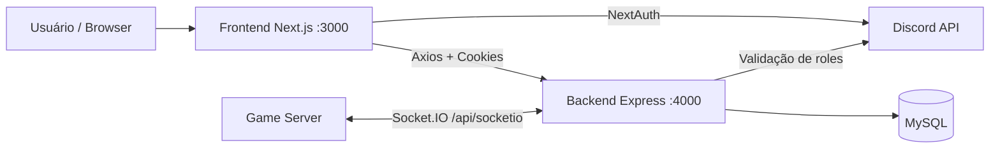

# Boregerenciador

[](https://www.typescriptlang.org/)
[](https://nextjs.org/)
[](https://reactjs.org/)
[](https://expressjs.com/)
[](https://socket.io/)
[](https://www.mysql.com/)

Painel administrativo para gestão do servidor Bore, com frontend em Next.js e backend dedicado em Express (MVC + POO), autenticação via Discord (NextAuth), controle de permissões por cargos e integração em tempo real com Socket.IO.

---


## 📖 Documentação da API (Scalar)

O projeto já conta com documentação interativa da API utilizando [Scalar](https://scalar.com/) integrada ao Next.js:

- **Documentação Pública:**
  - URL: `/docs/public`
  - Disponível para qualquer usuário, sem autenticação.
  - Exibe todos os endpoints públicos (stats, replays, etc).

- **Documentação Privada:**
  - URL: `/docs/private`
  - Requer login e permissão de Dono, Diretor ou Gerente.
  - Exibe todos os endpoints administrativos (players, bans, mutes, cargos, configs) além dos públicos.

Ambas as rotas usam o componente `ApiReference` do Scalar, consumindo os arquivos OpenAPI localizados em `lib/openapi-public.ts` e `lib/openapi-private.ts`.

> Para acessar a documentação privada, faça login no sistema e acesse `/docs/private`.


```bash
# 1. Clone o repositório
git clone <seu-repo>
cd boregerenciador

# 2. Instale as dependências
npm install

# 3. Configure o .env (veja seção Variáveis de Ambiente)
cp .env.example .env
# Edite .env com suas credenciais

# 4. Rode o projeto
npm run dev
```

✅ Frontend: http://localhost:3000  
✅ Backend: http://localhost:4000

---

## 📚 📚 Sumário

- [🚀 Quick Start](#-quick-start)
- [📖 Visão geral](#-visão-geral)
- [🏗️ Stack e arquitetura](#️-stack-e-arquitetura)
- [🔐 Fluxo de autenticação e autorização](#-fluxo-de-autenticação-e-autorização)
- [📁 Estrutura do projeto](#-estrutura-do-projeto)
- [🛣️ API backend (mapa de rotas)](#️-api-backend-mapa-de-rotas)
- [🔌 WebSocket (socket.io)](#-websocket-socketio)
- [📊 Observabilidade e logs](#-observabilidade-e-logs)
- [⚙️ Variáveis de ambiente](#️-variáveis-de-ambiente)
- [💻 Como rodar localmente](#-como-rodar-localmente)
- [📜 Scripts disponíveis](#-scripts-disponíveis)
- [🔧 Troubleshooting](#-troubleshooting)
- [🚀 Notas de deploy](#-notas-de-deploy)

---

## 📖 Visão geral

O projeto foi separado em dois blocos:

- **Frontend (Next.js)**: UI, navegação e sessão de usuário.
- **Backend (Express)**: API, regras de negócio, acesso ao MySQL e gateway Socket.IO.

Objetivos principais:

- Gestão de players com paginação e busca.
- Aplicação e remoção de bans/mutes.
- Gestão de cargos especiais (Legend/Mod).
- Alteração de senha com hash bcrypt.
- Controle de acesso por cargos do Discord.
- Comunicação em tempo real com o game server.

---

## 🏗️ Stack e arquitetura

### Tecnologias

- **Frontend**: Next.js 15, React 19, TypeScript, Tailwind.
- **Auth**: NextAuth + Discord OAuth2.
- **Backend**: Node.js, Express, TypeScript (tsx).
- **Banco**: MySQL (mysql2).
- **Tempo real**: Socket.IO.
- **HTTP client**: Axios.
- **Logs**: Pino + Pino Pretty.

### Diagrama (alto nível)



---

## 🔐 Fluxo de autenticação e autorização

### 1) Login

- Usuário autentica via Discord no NextAuth.
- No signIn, o projeto já valida se o usuário pertence ao Staff (DISCORD_STAFF_ROLE_ID) para liberar acesso inicial.

### 2) Chamada ao backend

- Frontend usa Axios com withCredentials: true.
- Backend aceita autenticação por:
  - **cookie de sessão NextAuth**, ou
  - **header Bearer token**.

### 3) Autorização por cargo

No backend:

- **requireAuth**: exige usuário autenticado.
- **requireManage**: exige permissão de gestão (CEO/Diretor/Gerente).
- **requireCeo**: exige cargo de CEO.

As permissões do Discord usam cache curto (DISCORD_PERMISSIONS_CACHE_MS) para reduzir chamadas externas.

---

## 📁 Estrutura do projeto

```text
app/                    # Frontend (Next.js App Router)
backend/
  server.ts             # Bootstrap backend (Express + Socket)
  src/
    controllers/        # Camada HTTP
    services/           # Regras de negócio / integrações
    repositories/       # Acesso ao MySQL
    middlewares/        # AuthN/AuthZ
    routes/             # Mapeamento de rotas
    lib/                # Logger e utilitários
components/             # Componentes React
hooks/                  # Hooks do frontend
lib/                    # Auth NextAuth, clientes e utilitários do frontend
scripts/dev-clean.js    # Limpeza de portas no ambiente local
```

> Observação: em app/api, permanece somente auth/[...nextauth].

---

## 🛣️ API backend (mapa de rotas)

Base URL local: http://localhost:4000/api

### Rotas de gestão (requireManage)

- GET /players
- POST /players/:id/mod
- POST /players/:id/legend
- PUT /players/:id/password
- GET /bans
- POST /bans
- POST /bans/:id/unban
- GET /mutes
- POST /mutes
- POST /mutes/:id/unmute
- GET /public/stats
- GET /public/recs
- GET /public/recs/:id
- GET /socket/status

### Rotas de configuração/perfil

- GET /config/discord-roles (autenticado)
- GET|POST /config/can-manage (autenticado)
- GET|POST /config/is-ceo (autenticado)
- POST /config/reset-vip (**requireCeo**)

> Nota: apesar do prefixo public, as rotas /public/* estão protegidas por requireManage no backend atual.

---

## 🔌 WebSocket (Socket.IO)

Endpoint: http://localhost:4000 com path /api/socketio

### Segurança

- O handshake exige token (socket.handshake.auth.token).
- Só conecta quem possui canManage.

### Eventos recebidos pelo backend

- sync:players
- sync:bans
- sync:mutes
- sync:stats
- sync:recs
- action:ban
- action:unban
- action:mute
- action:unmute
- action:setMod
- action:setLegend
- action:changePassword

### Eventos emitidos para integração

- command:ban
- command:unban
- command:mute
- command:unmute
- command:setMod
- command:setLegend
- command:changePassword

---

## 📊 Observabilidade e logs

### Em desenvolvimento

- Logs detalhados (nível debug por padrão).
- Prefixos visuais no terminal (FRONT/BACK) com timestamp.
- Request logging com requestId, path, status, duração e contexto adicional.

### Em produção

- Log padrão mais estratégico (warn/error).
- Resumo automático a cada **5 minutos** via evento production_5m_summary com:
  - volume de requests,
  - sucesso/4xx/5xx,
  - requisições lentas,
  - rota mais lenta da janela (top 1).

---

## ⚙️ Variáveis de ambiente

Crie um arquivo .env na raiz:

```bash
# Frontend / Auth
NEXTAUTH_URL=http://localhost:3000
NEXTAUTH_SECRET=sua_chave_secreta
NEXT_PUBLIC_BACKEND_URL=http://localhost:4000
NEXT_PUBLIC_SOCKET_URL=http://localhost:4000

# Backend
BACKEND_PORT=4000
FRONTEND_URL=http://localhost:3000
SOCKET_CORS_ORIGIN=http://localhost:3000

# Logs / Observabilidade
LOG_LEVEL=warn
SLOW_REQUEST_MS=1200

# Cache de roles do Discord (ms)
DISCORD_PERMISSIONS_CACHE_MS=120000

# MySQL
DB_HOST=localhost
DB_USER=root
DB_PASSWORD=sua_senha
DB_DATABASE=seu_banco
DB_PORT=3306
DB_WAIT_FOR_CONNECTIONS=true
DB_CONNECTION_LIMIT=10
DB_QUEUE_LIMIT=0

# Discord OAuth / Roles
DISCORD_CLIENT_ID=seu_client_id
DISCORD_CLIENT_SECRET=seu_client_secret
DISCORD_GUILD_ID=id_da_guild
DISCORD_STAFF_ROLE_ID=id_staff
DISCORD_CEO_ROLE_ID=id_ceo
DISCORD_DIRETOR_ROLE_ID=id_diretor
DISCORD_GERENTE_ROLE_ID=id_gerente
```

---

## 💻 Como rodar localmente

```bash
npm install
npm run dev
```

O comando dev:

- limpa portas comuns (3000, 3001, 4000, 4001),
- sobe frontend + backend em paralelo.

URLs:

- Frontend: http://localhost:3000
- Backend: http://localhost:4000

---

## 📜 Scripts disponíveis

- npm run dev → desenvolvimento completo (front + back)
- npm run dev:clean → libera portas de desenvolvimento
- npm run dev:frontend → apenas Next.js
- npm run dev:backend → apenas backend Express
- npm run build → build do Next.js
- npm run start → start do Next.js
- npm run lint → lint do projeto

---

## 🔧 Troubleshooting

### EADDRINUSE (porta ocupada)

```bash
npm run dev:clean
```

### 401 Não autenticado

- Verifique se login no Discord foi concluído.
- Confirme NEXTAUTH_SECRET e NEXTAUTH_URL corretos.
- Confirme que o frontend está enviando cookies para o backend.

### 403 Sem permissão

- Usuário autenticou, mas não possui cargo necessário (manage/CEO).
- Verifique IDs de cargos no .env.

### Socket não conecta

- Confira NEXT_PUBLIC_SOCKET_URL e path /api/socketio.
- Verifique se o token da sessão está presente no handshake.

---

## 🚀 Notas de deploy

- Em produção, execute frontend e backend como processos/serviços separados.
- Garanta FRONTEND_URL e SOCKET_CORS_ORIGIN apontando para o domínio correto.
- Se usar proxy reverso, mantenha o roteamento para:
  - frontend (/)
  - backend API (/api)
  - socket (/api/socketio)
